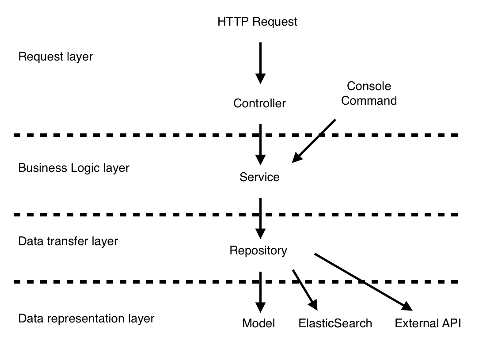

# Laravel Architecture
A scalable and maintainable way to structure Laravel applications.

This package is a work in progress, click the star above to show your interest in what we are creating!

## High level explanation

### Requests layer
This is the layer that will pass the data on the the services. This will often be a controller receiving a HTTP request or a console command.

### Business Logic layer
Your business logic will bring together all the relevant parts of your application. For example, your UserSignUpService will likely pass data to the UserRepository to create a user in your data store. You also may want to send off a welcome email or add in some example data to show them how to use your application such as an example ToDo item. All of this is unique to how you are building your application which is why we call it Business Logic

### Data transfer layer
This layer is your interactions with where you are keeping your data. In a modern application it is common to use multiple different types of data store in an application. By having this layer you not only know where to look to find this type of code, but you also can switch types of data storage as needed while your application grows with minimal effort. You may start off with everything in a standard relational database but then as your application grows and your application requirements grow, you may switch out some areas to an ElasticSearch cluster or even split the application up into multiple MicroServices.

### Data representation layer
These are your classes that represent your data. This is where you will transform data in and out of the data store. If you are using an ORM, these will be your models. This layer also deals with the connections to the data source
